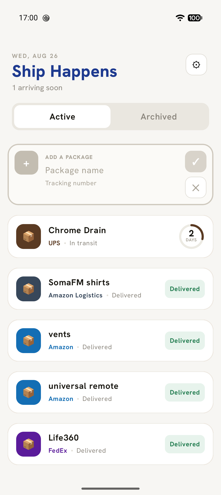
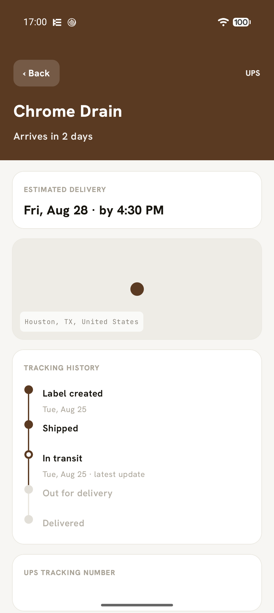

# Ship Happens

A package-tracking app for Android and iOS, built once in Kotlin Multiplatform / Compose
Multiplatform and shipped natively on both platforms. Add a tracking number (manually, or by
detecting one you just copied), and Ship Happens polls the right carrier or aggregator, shows a
timeline of scan events, and tells you when a package is arriving. Delivered packages archive with
undo; settings hold per-source API keys and a refresh cadence.

The full visual spec — every screen, state, and interaction (empty state, list, detail, archive
swipe, settings cards, clipboard-import card, toasts) — lives in
[`resources/design/Parcels.dc.html`](resources/design/Parcels.dc.html). Open it in a browser for the canonical UI
reference.

<p>
  
  
</p>

## Module map

```
domain/        Domain types: Parcel, Carrier, TrackingStatus/Event/Snapshot, carrier detection.
               No dependencies.
data/          Room 3 database, ParcelRepository, SettingsRepository (DataStore), clipboard
               import manager, SourceRegistry, DailyRefreshRunner (the 8am background pass, with
               WorkManager/BGTaskScheduler and notifier actuals per platform), Koin DI wiring.
design/        Design system: ShipTheme, ShipColors, font resources (Hanken + mono), and the
               canonical HTML visual spec (Parcels.dc.html).
source/
  api/         The plugin contract: TrackingSource, SourceConfig, SourceResult.
               Every source module depends only on this.
  webview/     Shared WebView scraping machinery: WebProviderSpec, PayloadRouter, ScrapeTracer.
  webview-testing/   Testing contracts: WebSpecContract, WebSourceContract.
  ups/         UPS carrier source (ups.com in a WebView).
  usps/        USPS carrier source (tools.usps.com in a WebView).
  fedex/       FedEx carrier source (fedex.com/fedextrack in a WebView).
  amazon/      Amazon orders source (amazon.com order pages, login required).
  amzl/        Amazon Logistics source (track.amazon.com, anonymous TBA tracking).
  dhlecs/      DHL eCommerce source (webtrack.dhlecs.com, anonymous API + locale-file vocabulary).
ui/            Compose Multiplatform screens (list, detail, settings), Navigation 3, ViewModels,
               and appModules() — the single place all Koin modules are assembled.
app-android/   Android application shell: MainActivity, Koin bootstrap with androidContext.
app-ios/       iOS application shell (SwiftUI entry point hosting the shared Compose UI),
               generated via XcodeGen from app-ios/project.yml.
build-logic/   Gradle convention plugin `shiphappens.source-module` for the carrier modules.
```

Dependency direction is one-way: `source/*` depends on `source/api` (and `domain` for domain
types) but never on `data` or `ui`; `data` depends on `source/api` for the `TrackingSource`
contract but not on any specific source; `design` depends only on `domain`; `ui` wires everything
together in `ui/src/commonMain/kotlin/com/dgmltn/shiphappens/ui/di/AppModules.kt`.

## Build & run

### Android

```bash
./gradlew :app-android:assembleDebug --console=plain
```

Produces `app-android/build/outputs/apk/debug/app-android-debug.apk` (applicationId
`com.dgmltn.shiphappens`). Install with `adb install` or run the `app-android` configuration from
Android Studio / IntelliJ.

### iOS

The Xcode project is generated, not checked in. Install [XcodeGen](https://github.com/yonaskolb/XcodeGen)
(`brew install xcodegen`) once, then:

```bash
cd app-ios
xcodegen generate
cd ..
xcodebuild -project app-ios/ShipHappens.xcodeproj -scheme ShipHappens \
  -destination 'generic/platform=iOS Simulator' -configuration Debug build
```

Or just open `app-ios/ShipHappens.xcodeproj` in Xcode after `xcodegen generate` and run normally —
the scheme's pre-build script runs `./gradlew :ui:embedAndSignAppleFrameworkForXcode` for you, so
the shared Compose UI framework is always rebuilt before the Swift shell links against it.

Re-run `xcodegen generate` any time `app-ios/project.yml` changes; the generated `.xcodeproj` is
gitignored and recreated by `xcodegen generate`, while `app-ios/ShipHappens/Info.plist` and
`app-ios/project.yml` are tracked in git.

## Running tests

```bash
./gradlew :domain:jvmTest :data:jvmTest :source:api:jvmTest :source:ups:jvmTest \
          :source:usps:jvmTest :source:fedex:jvmTest :source:amazon:jvmTest \
          :source:amzl:jvmTest :source:dhlecs:jvmTest :source:webview:jvmTest \
          :ui:testAndroidHostTest --console=plain
```

Note `:ui`'s task is `testAndroidHostTest`, not `testDebugUnitTest` — the UI module's unit tests
run on the Android-host test source set. Current suite: 499 tests across 11 modules (domain 31,
data 99, api 2, ups 23, usps 27, fedex 33, amazon 53, amzl 20, dhlecs 26, webview 120, ui 65),
all passing.

## Daily update

With "Daily update" enabled in Settings, the app refreshes every undelivered parcel once a day at
the chosen local time (8:00 AM by default) and posts one notification per parcel whose status or
delivery date changed — or whose delivery simply drew near: an unmoved ETA that has become
"tomorrow", "today", or a day past due since the previous check is news too, and is announced once
per crossing (`Imminence`, in `domain`). Copy speaks relatively while the date is close ("Arriving
tomorrow", "Arriving in 3 days, on Saturday") and falls back to the date beyond a week. Every pass
also posts, on a separate diagnostics channel, a live progress
notification while it runs and an unconditional per-parcel summary when it finishes (or a failure
notification if the pass itself dies) — so a quiet pass is still visibly a pass that ran. The
decision logic — candidate selection, change detection, notification
copy, sign-in-nag dedup — lives in `data/commonMain` (`DailyRefreshRunner`, `NotificationText`);
Android schedules it with self-rescheduling WorkManager one-time work, iOS with `BGAppRefreshTask`,
which iOS runs opportunistically, so the time is a hint there rather than a promise. iOS also has
no WebView scraper yet, so its pass finds no usable source and stays quiet until one lands.

Notifications need runtime permission, requested when the toggle is switched on. Denial leaves the
toggle off rather than creating a setting that silently does nothing.

## How to add a tracking source

The plugin boundary is `TrackingSource` in `source/api`. A website-scraped carrier never touches
`domain` (beyond its `Carrier` entry), `data`, or the scraping machinery:

1. **Declare the carrier** in `WellKnownCarriers` (`domain`): code, display name, accent, and the
   regex that claims its tracking-number shape. Detection everywhere derives from that pattern.
2. **Write the spec** in a new `source/<name>` module whose `build.gradle.kts` is just
   `plugins { id("shiphappens.source-module") }`. One `WebProviderSpec` holds the carrier's
   `StatusVocabulary` and `TrackerPageRules`, its extraction JS, an optional `LoginRecipe`
   (`BridgeScripts.loggedInProbe` covers the usual logout-link-or-sign-out-text check), any
   extra challenge markers, and an optional API parser returning `TrackingSnapshot`. End the file
   with `val <name>SourceModule: Module = webSourceModule(<Name>WebSpec)`.
3. **Test it** with a `<Name>ContractTest` that calls `WebSpecContract.verify` and
   `WebSourceContract.verify` from `:source:webview-testing` with the carrier's sample numbers
   and not-found wording, plus a vocabulary test over captured page strings.
4. **Register it**: `include(":source:<name>")` in `settings.gradle.kts`, the module in
   `ui/build.gradle.kts`, and `<name>SourceModule` in `appModules()`
   (`ui/src/commonMain/kotlin/com/dgmltn/shiphappens/ui/di/AppModules.kt`). `SourceRegistry`
   picks up every bound `TrackingSource` automatically.

## Settings & API keys

`SettingsRepository` (`data`) persists source configs, auto-clipboard-import, and refresh
frequency in a Jetpack/Multiplatform DataStore `Preferences` file. **Keys are stored
unencrypted, by design** — this is a v1 personal-use app with no server component; there is no
keychain/keystore integration. Do not put production or shared credentials in the app.
