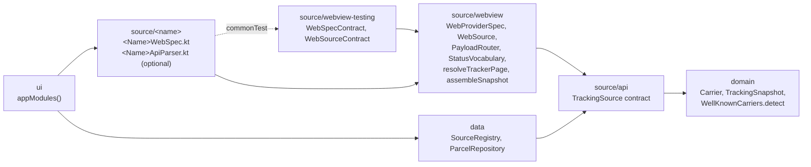
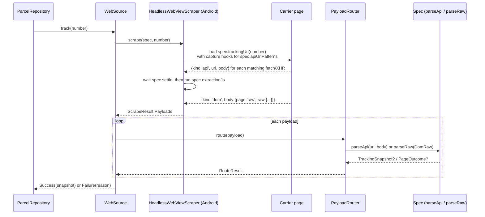
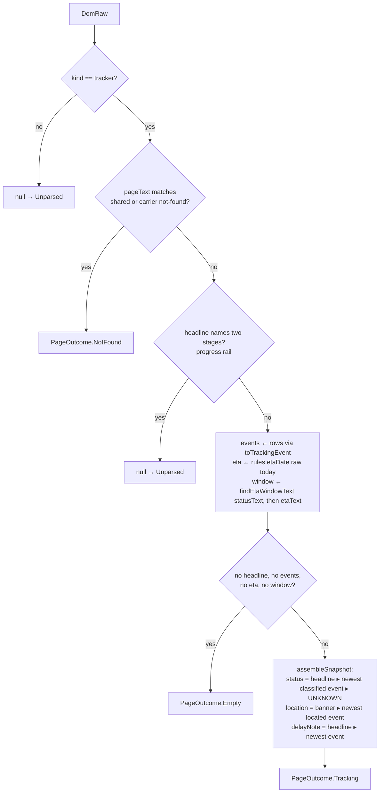

# Adding a carrier source

A *source* is anything that can turn a tracking number into a `TrackingSnapshot`. Six ship today
(UPS, USPS, FedEx, Amazon orders, Amazon Logistics, DHL eCommerce), and all six are the same
thing: one `WebProviderSpec` that tells the shared WebView machinery how to read the carrier's own
website. This document is the recipe for the seventh.

The short version: **declare the carrier, write one spec file, write one contract test, register
the module.** Everything that decides anything lives in shared Kotlin under `source/webview`, so a
new carrier contributes data, selectors, and a small vocabulary, not logic.

## Where a source sits



Dependency direction is one way. A carrier module depends on `source/webview` and, through it,
on `source/api` and `domain`. It never depends on `data` or `ui`, and nothing in `data` knows a
specific carrier exists: `SourceRegistry` is built from every `TrackingSource` bound in Koin.

## What happens on a refresh

`WebSource.track` is the same for every carrier. The spec supplies the URL, the capture patterns,
the extraction script, and two parse functions; the framework does the rest.



Two things follow from this picture and shape every rule below:

- **The API capture is the rich layer when a carrier has one; the DOM read is the fallback.** For
  DOM-only carriers (FedEx, Amazon) the DOM read is the only layer.
- **The extraction JS runs on a device and cannot be unit-tested.** `commonTest` has no JS engine.
  So the JS *reads* text and returns it verbatim as a `DomRaw`; every decision about that text
  (status, dates, not-found, delay) is made by `parseRaw` in Kotlin, where a captured page string
  becomes a test fixture. Two shipped bugs came from breaking this rule.

## Step 1: declare the carrier

`domain/src/commonMain/kotlin/com/dgmltn/shiphappens/domain/Carrier.kt`:

```kotlin
val DHL_EXPRESS = Carrier("dhlexpress", "DHL Express", "#B3040D", Regex("^\\d{10}$"))
val all = listOf(UPS, USPS, FEDEX, AMAZON, AMAZON_LOGISTICS, DHL_ECOMMERCE, DHL_EXPRESS)
```

- `code` is a persistence key (it keys `SourceConfig` and `Parcel.sourceId` in the database) and
  the default `sourceId` of the spec. Pick it once; `CarrierDetectionTest` pins the list.
- `numberPattern` is matched against the *normalized* number: whitespace and hyphens stripped,
  uppercased (`normalizeTracking`). Detection everywhere (clipboard import, add screen, source
  resolution) derives from this one regex.
- Patterns must be mutually exclusive with the existing six. If a new shape overlaps an old one,
  exclude it in the pattern itself (FedEx does this with a negative lookahead for USPS prefixes)
  rather than relying on list order.
- Add a `detects_<name>` case to `CarrierDetectionTest` with the shapes it claims and the
  neighbours it must reject.

## Step 2: scaffold the module

```
settings.gradle.kts            include(":source:dhlexpress")
source/dhlexpress/build.gradle.kts
    plugins { id("shiphappens.source-module") }
ui/build.gradle.kts            implementation(projects.source.dhlexpress)
ui/.../di/AppModules.kt        dhlExpressSourceModule in appModules()
```

The convention plugin (`build-logic/src/main/kotlin/shiphappens.source-module.gradle.kts`)
applies the KMP, serialization, and Android KMP library plugins, the jvm and iOS targets, and
every dependency a carrier needs, and derives the Android namespace from the module name. A
carrier build file is those three lines and nothing else. Use a single lowercase word for the
module name; hyphens are stripped when the namespace is derived.

## Step 3: write the spec

One file, `source/<name>/src/commonMain/kotlin/com/dgmltn/shiphappens/source/<name>/<Name>WebSpec.kt`,
holding five things in this order. USPS is the reference example; copy its shape.

### 3a. Vocabulary

```kotlin
internal val DHLEXPRESS_VOCABULARY = StatusVocabulary(
    StatusKeywords(
        labelCreated = listOf("shipment information received"),
        shipped = listOf("picked up"),
        inTransit = listOf("processed at", "arrived at", "departed from"),
        outForDelivery = listOf("with delivery courier"),
        exception = listOf("clearance delay", "on hold"),
    ),
)
```

`StatusVocabulary` is one precedence chain over the shared carrier-neutral phrases plus the
extras you give it. Lowercase substrings, evaluated in this order: out for delivery, delivered,
exception, label created, shipped, in transit. Rules that are easy to get wrong:

- **Add phrases, never reimplement the chain.** `local() ?: shared()` composition lets a
  late-stage local phrase shadow an earlier shared match in the same sentence.
- **There is no delay stage.** A delay is a modifier that rides alongside any stage
  (`delayNote` on the snapshot). Give delay wordings to `delayed`, not to `exception`.
- **Negated deliveries are handled for you.** "undelivered" and "not delivered" classify as
  exceptions on every vocabulary.
- **API codes go through the same chain.** `classifyToken("OUT_FOR_DELIVERY")` and
  `classifyToken("OutForDelivery")` humanize the code to words first, so an API vocabulary is just
  more extras (see AMZL).
- **Pages that mix shipment copy with unrelated copy** (Amazon's order pages carry returns cards)
  use `base = BaseKeywords.None` and declare every phrase, including "delivered", themselves.

### 3b. Page rules

```kotlin
internal val DHLEXPRESS_PAGE = TrackerPageRules(
    vocabulary = DHLEXPRESS_VOCABULARY,
    notFound = listOf("""no shipment found for this number"""),
)
```

`resolveTrackerPage(raw, rules)` does the rest, and this is the ladder every carrier shares:



The hooks exist for the two cases the ladder cannot know: `location` when the banner carries
page phrasing ("Currently in Sacramento, CA", FedEx strips the prefix) and `etaDate` when the
promise needs a gate before parsing (Amazon reads it out of a status headline). The `etaDate`
hook receives the whole `DomRaw`, not just `etaText`, so a carrier can read the promise from
wherever the page puts it. Most carriers override nothing.

The shared not-found list already holds the generic wordings ("couldn't find", "invalid
tracking", "no record of this tracking"); `notFound` is for the carrier's own copy.

### 3c. Extraction JS

```kotlin
private val DHLEXPRESS_EXTRACTION_JS = """
function() {
  var text = (document.body && document.body.innerText) || '';
  function clean(el) { return el ? el.textContent.replace(/\s+/g, ' ').trim() : null; }
  var statusText = clean(document.querySelector('.tracking-status h2'))
    || clean(document.querySelector('[data-test="status-headline"]'));
  var etaText = clean(document.querySelector('.delivery-estimate'));
  var events = [];
  var rows = document.querySelectorAll('.event-row');
  for (var i = 0; i < rows.length; i++) {
    events.push({
      whenText: clean(rows[i].querySelector('.event-date')) + ' ' + clean(rows[i].querySelector('.event-time')),
      description: clean(rows[i].querySelector('.event-description')),
      location: clean(rows[i].querySelector('.event-location'))
    });
  }
  var d = new Date();
  var todayIso = d.getFullYear() + '-' + String(d.getMonth() + 1).padStart(2, '0') + '-' + String(d.getDate()).padStart(2, '0');
  return {page: 'raw', raw: {kind: 'tracker', statusText: statusText, etaText: etaText,
                             todayIso: todayIso, events: events,
                             pageText: text.replace(/\s+/g, ' ').slice(0, 400)}};
}
""".trimIndent()
```

The contract for this function expression:

| Return | Meaning |
|---|---|
| `{page:'raw', raw:{...}}` | The normal case. Kotlin decides everything from the fields. |
| `{page:'loginWall'}` | Only when the decision genuinely depends on a selector (a sign-in form). |
| `{page:'goto', url}` | A one-hop navigation; the router validates the URL against `cookieDomain`. |
| `{page:'empty', why, probe}` | Nothing readable. Carry `why` and a `probe` of selector counts for the tracer. |

`raw` fields, all optional except `kind`:

| Field | Send it when |
|---|---|
| `kind` | `'tracker'` for a detail page, `'cards'` for an order list (Amazon only). |
| `statusText` | The precise status element. **Query selectors in priority order, never as one comma list**: `querySelector('a, b')` returns document order, and an ancestor wrapper's concatenated text has misclassified a delivered package before. |
| `etaText` | The whole promise banner, verbatim, tooltip junk included. Kotlin digs the date and window out. |
| `etaDate`, `etaWindowText` | Only if the page gives you ISO / a bare window phrase already. |
| `locationText` | A current-location banner shown without event rows. |
| `events[]` | `description`, `location`, and either an ISO `timestamp` or the verbatim `whenText` (date header plus time). Kotlin builds the instant. |
| `todayIso` | Always. Relative days ("tomorrow") and year-less dates ("Saturday, August 22") resolve against it. |
| `pageText` | Always: the first 400 characters of body text, so not-found wording is classified in Kotlin. |

Extra keys (`why`, `probe`, `url`) are ignored by the decoder and logged verbatim by the tracer;
they are how a selector drift gets diagnosed from a log instead of a device session.

For a page that needs choreography (click "View more details", wait for the SPA), declare
`function(finish)` and call `finish(result)` later; a backstop timer reports empty if it never
comes. FedEx is the example.

### 3d. Login, capture, markers, settle

```kotlin
val DhlExpressWebSpec = WebProviderSpec(
    carrier = WellKnownCarriers.DHL_EXPRESS,
    cookieDomain = "dhl.com",
    trackingUrl = { "https://www.dhl.com/us-en/home/tracking.html?tracking-id=$it" },
    extractionJs = DHLEXPRESS_EXTRACTION_JS,
    login = LoginRecipe(
        "https://www.dhl.com/us-en/auth/login.html",
        BridgeScripts.loggedInProbe(listOf("a[href*=\"logout\"]"), "sign out|welcome,"),
    ),
    apiUrlPatterns = listOf(""".*api\.dhl\.com/track/shipments.*"""),
    extraChallengeMarkers = listOf("Reference #"),
    settle = 6.seconds,
    parseApi = { _, body -> DhlExpressApiParser.parse(body) },
    parseRaw = { resolveTrackerPage(it, DHLEXPRESS_PAGE) },
)

val dhlExpressSourceModule: Module = webSourceModule(DhlExpressWebSpec)
```

| Field | Notes |
|---|---|
| `cookieDomain` | Scopes cookie clearing, bridge injection, and allowed hops. Use the narrowest host that still covers the tracking page (AMZL uses `track.amazon.com`, not `amazon.com`). |
| `trackingUrl` | Receives the raw number; normalize inside if the site wants a specific shape. |
| `login` | Null for anonymous trackers. Settings then hides sign-in for the carrier. `loggedInProbe` covers "a logout link exists or the page says sign out"; write custom JS only when the chrome needs more. |
| `apiUrlPatterns` | JS regex sources matched against fetch/XHR URLs. Empty means no hooks are injected at all, which matters when a site's bot defense keys on them (FedEx). |
| `extraChallengeMarkers` | Bot-defense wordings on top of the shared "Access Denied" / "verify you are a human". A match aborts the scrape as a challenge before the extractor runs, so only add phrases that never appear in ordinary shipping copy. |
| `settle` | Delay after page load before the extractor runs. Raise it for a SPA that client-routes after load. |
| `sourceId` | Defaults to the carrier code. Leave it. |

### 3e. API parser (optional)

When the page fetches its data from an in-page API, capture it: it is richer and more stable
than the DOM. Write `<Name>ApiParser.kt` with tolerant `@Serializable` DTOs (every field
optional) and one `parse(body): TrackingSnapshot?` that ends in `assembleSnapshot`:

```kotlin
object DhlExpressApiParser {
    private val json = Json { ignoreUnknownKeys = true }

    fun parse(body: String): TrackingSnapshot? {
        val shipment = runCatching { json.decodeFromString<Response>(body) }.getOrNull()
            ?.shipments?.firstOrNull() ?: return null          // null = not tracking JSON
        val zone = TimeZone.currentSystemDefault()
        val events = shipment.events.mapNotNull { e ->
            val date = parseAnyDate(e.date) ?: return@mapNotNull null
            TrackingEvent(
                timestamp = eventAt(date, parseTimeOfDay(e.time), zoneForAbbreviation(e.zone) ?: zone),
                description = e.description ?: return@mapNotNull null,
                location = e.location,
                status = DHLEXPRESS_VOCABULARY.classify(e.description),
            )
        }
        return assembleSnapshot(
            vocabulary = DHLEXPRESS_VOCABULARY,
            headline = shipment.status,
            events = events,
            etaDate = parseAnyDate(shipment.estimatedDelivery),
            delayNote = headlineThenNewestEvent(DHLEXPRESS_VOCABULARY, shipment.status, events),
        )
    }
}
```

Return null for anything that is not tracking JSON, including in-band "not found" errors on
HTTP 200; the DOM read owns the not-found outcome. Use the shared helpers rather than writing
date code: `parseAnyDate` (ISO, M/D/YYYY, month names), `parseCompactDate` (`20260714`),
`parseTimeOfDay` (12- and 24-hour, seconds, narrow spaces), `eventAt`, `zoneForAbbreviation`
(US zone abbreviations to IANA), `parseEtaWindow` / `findEtaWindowText`.

## Step 4: tests

Three files in `source/<name>/src/commonTest/...`.

**`<Name>ContractTest.kt`**, the part every carrier shares. Any assertion added to the contracts
later runs against your carrier too.

```kotlin
class DhlExpressContractTest {
    @Test fun spec_contract() = WebSpecContract.verify(
        DhlExpressWebSpec,
        SpecSamples(
            trackingNumber = "1234567890",
            capturedApiUrl = "https://api.dhl.com/track/shipments?trackingNumber=1234567890",
            uncapturedUrls = listOf("https://www.dhl.com/us-en/home/tracking.html"),
            notFound = listOf(DomRaw(kind = "tracker", pageText = "No shipment found for this number")),
            apiBody = """{"shipments":[{"status":"Delivered","events":[]}]}""" to TrackingStatus.DELIVERED,
        ),
    )

    @Test fun source_contract() = WebSourceContract.verify(
        DhlExpressWebSpec,
        claims = listOf("1234567890", "12 3456 7890"),
        rejects = listOf("1Z999AA10123456784", "123456789"),
    )

    @Test fun track_fails_without_a_scraper() = runTest {
        WebSourceContract.verifyTrackFailsWithoutScraper(DhlExpressWebSpec, "1234567890")
    }
}
```

**`<Name>VocabularyTest.kt`**: the carrier's wordings through `DHLEXPRESS_VOCABULARY.classify`
and full `DomRaw` fixtures through `resolveTrackerPage(raw, DHLEXPRESS_PAGE)`. The fixture
strings should be verbatim captures from the live page (the tracer prints them), because the
whole point of the raw-reader split is that a real page string can be asserted against without
a device.

**`<Name>ApiParserTest.kt`**: a captured response body as the fixture, asserting status, ETA,
location, event order, and the delay note.

Run `./gradlew :source:<name>:jvmTest --console=plain`, then the full suite listed in the README.

## Step 5: device QA

Selectors and API shapes can only be validated against the live site. Install a debug build,
add a real number, and read the tracer:

```
adb logcat -s ShipScrape
```

It logs every payload, the routed outcome, the `why`/`probe` diagnostics from a bailed
extractor, and the login state. Iterate on selectors until a real package produces a
`Tracking` outcome at each stage you can observe. Capture the page strings and API bodies you
see into the test fixtures; that is what makes the next selector drift a unit-test fix instead
of another device hunt. Write the findings up under `docs/superpowers/qa/`.

Uninstall instrumented builds before you stop, and never commit a real tracking number, even in
a fixture. Fabricate one of the same shape.

## Rules that are not negotiable

- **The boundary.** `source/webview` and `source/webview-testing` hold mechanisms and generic,
  carrier-neutral English. Every selector, URL, carrier phrase, API field name, token, and sample
  number stays in the carrier's module (number patterns live on the carrier in `domain`). If a
  phrase you want to share is one any carrier could print, add it to the shared list; if only
  your carrier prints it, it is an extra.
- **JS reads, Kotlin decides.** No status vocabulary, date arithmetic, or not-found regex in
  the blob.
- **Delay is orthogonal to stage.** Never map a delay wording to a status.
- **Fixtures are captures.** Assertions over invented strings prove nothing about the live page.

## Checklist

- [ ] `Carrier` entry with `numberPattern`; `CarrierDetectionTest` case
- [ ] `settings.gradle.kts` include; three-line `build.gradle.kts`; `ui/build.gradle.kts`; `appModules()`
- [ ] `<Name>WebSpec.kt`: vocabulary, page rules, extraction JS, spec, `webSourceModule`
- [ ] `<Name>ApiParser.kt` if the page has an in-page API
- [ ] `<Name>ContractTest`, `<Name>VocabularyTest`, `<Name>ApiParserTest`
- [ ] Full suite green; `:source:<name>:compileKotlinIosSimulatorArm64` compiles
- [ ] Device QA with the tracer; captures folded into fixtures; QA note in `docs/superpowers/qa/`
- [ ] README module map line
